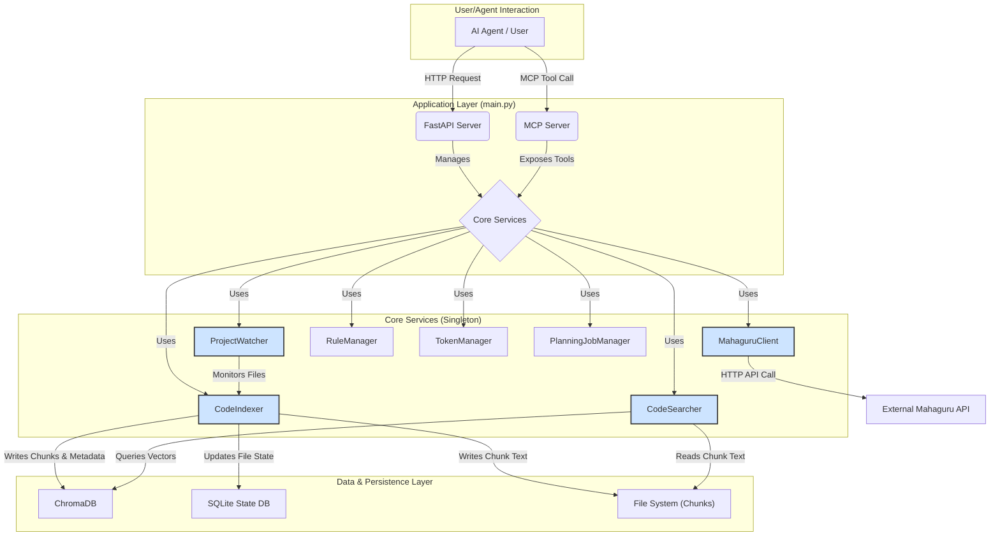
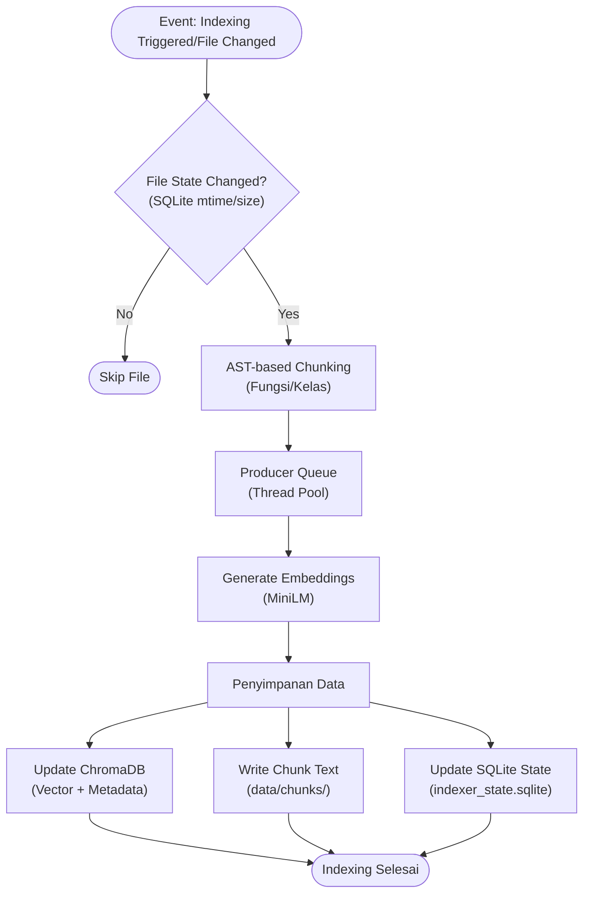
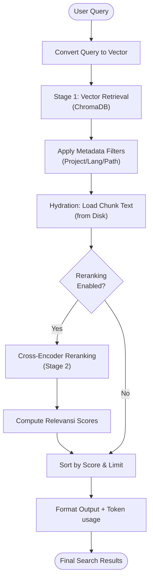
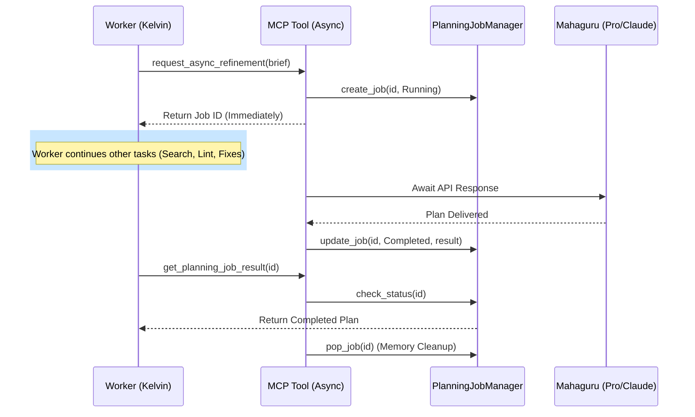

# **Arsitektur Sistem: Code Memory (mcp-code-search)**

Dokumen ini menjelaskan desain teknis dan arsitektur dari proyek Code-Memory MCP.

## **1. Ringkasan (Overview)**

Code Memory adalah layanan pencarian kode semantik lokal yang dirancang untuk diintegrasikan sebagai *tool* dalam arsitektur AI Agent (seperti Antigravity atau Claude Desktop). Layanan ini mengindeks basis kode lokal dan memungkinkan kueri bahasa alami untuk menemukan potongan kode yang relevan dengan akurasi tinggi.

## **2. Konsep Inti (Core Concepts)**

### **2.1. Smart Chunking (AST-based)**
Alih-alih memotong teks secara sembarangan berdasarkan jumlah karakter, sistem ini menggunakan *Abstract Syntax Trees* (AST) untuk memecah kode berdasarkan batas-batas logis seperti fungsi, kelas, dan metode.
- **Lokasi Kode:** `core/ast_chunker.py`
- **Manfaat:** Menjaga keutuhan konteks fungsional dalam setiap cuplikan yang diindeks.

### **2.2. Two-Stage Semantic Search**
Proses pencarian dilakukan dalam dua tahap untuk menyeimbangkan kecepatan dan akurasi:
1.  **Retrieval (Tahap 1):** Menggunakan *vector search* (ChromaDB) untuk mengambil kandidat potensial tercepat.
2.  **Reranking (Tahap 2):** Menggunakan model **Cross-Encoder** (`ms-marco-MiniLM-L-6-v2`) untuk menilai ulang kandidat teratas.
- **Lokasi Kode:** `core/searcher.py`

### **2.3. AI Cascading (Mahaguru Escalation)**
Memungkinkan agen pekerja untuk mengeskalasi tugas kompleks ke model AI yang lebih kuat (Mahaguru). Sistem mendukung dua mode:
- **Blocking (Sequential):** Worker menunggu Mahaguru selesai merespons.
- **Non-Blocking (Parallel):** Worker memicu tugas di latar belakang menggunakan `PlanningJobManager` dan melanjutkan tugas lainnya.
- **Lokasi Kode:** `core/mahaguru_client.py` & `core/job_manager.py`

### **2.4. Idempotent Indexing**
Menggunakan database state (SQLite) untuk melacak `mtime` dan `size` setiap file. File yang tidak berubah tidak akan diindeks ulang, menghemat resource secara signifikan.
- **Lokasi Kode:** `core/indexer.py`

## **3. Diagram Komponen**

## **4. Detail Alur Kerja**

### **4.1. Alur Pengindeksan**

1. **Event:** Perubahan file dideteksi oleh `ProjectWatcher` atau perintah `index_folder`.
2. **State Check:** `CodeIndexer` memeriksa SQLite. Jika file identik (mtime/size sama), proses dilewati.
3. **Chunking:** `ASTChunker` memecah kode.
4. **Processing:** Vektor disimpan di ChromaDB, teks asli disimpan di `data/chunks/`, dan state diperbarui di SQLite.
5. **Concurrency:** Menggunakan pola *Producer-Consumer* dengan thread pool untuk efisiensi maksimal tanpa race conditions.

### **4.2. Alur Pencarian**

1. **Query:** User memberikan input natural language.
2. **Retrieval:** ChromaDB memberikan kandidat (default 20).
3. **Reranking:** Cross-Encoder memberikan skor relevansi baru.
4. **Final Results:** Hasil diurutkan berdasarkan skor tertinggi dan dikembalikan ke user.

### **4.3. Parallel Planning Flow (Asynchronous)**

1. **Trigger:** Worker mengirimkan permintaan perencanaan yang berat.
2. **Non-Blocking:** MCP tool segera mengembalikan `job_id`, membebaskan Worker untuk tugas lain.
3. **Background Processing:** Mahaguru berpikir di latar belakang. Registry (`PlanningJobManager`) melacak statusnya secara *thread-safe*.
4. **Retrieval & GC:** Worker mengambil hasil saat siap. Registry secara otomatis menghapus data dari memori (*Popping*) setelah dikonsumsi untuk mencegah kebocoran memori.

## **5. Teknologi yang Digunakan**
- **FastAPI:** Manajemen API & Lifecycle.
- **ChromaDB:** Vector store lokal.
- **SQLite3:** Persistensi state indexing.
- **Watchdog:** Monitoring file system.
- **Sentence-Transformers:** Model embedding & reranking.
